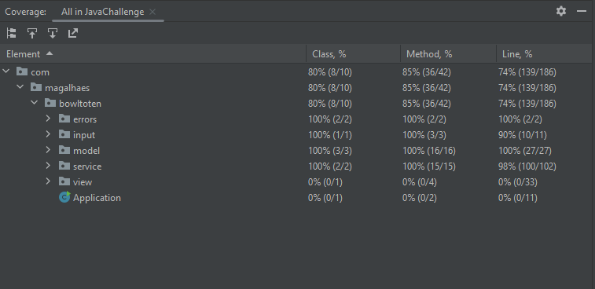

# Java Challenge

This project is designed to test your knowledge of the Java language, and assess your ability to create back-end products with attention to details, standards, and re-usability.

## Bowl To Ten

Bowl to ten is a program created by André de Magalhães. It is a CLI application aimed at calculating a Bowling frame notation based on a text file with the following format: 

```
Carl	10
Carl	10
Carl	10
Carl	10
Carl	10
Carl	10
Carl	10
Carl	10
Carl	10
Carl	10
Carl	10
Carl	10
```

## How to Run

To run the program you just need to run `mvn clean install` as a common maven application, with that you'll have a build of a .jar called `bowling-cli-snapshot.jar`.

With that, you're expected to run `java -jar ./bowling-cli-snapshot.jar /{pathToYourTxtFile}`.

As an output, you're expected to see something like this for the before mentioned example:

```
____________________________________________________________________________________
| Frame   | 1    | 2    | 3    | 4    | 5    | 6    | 7    | 8    | 9    | 10       |
|===================================================================================|
| Carl    |      |      |      |      |      |      |      |      |      |          |
| Pinfalls| _ | X| _ | X| _ | X| _ | X| _ | X| _ | X| _ | X| _ | X| _ | X| X | X | X|
| Score   | 30   | 60   | 90   | 120  | 150  | 180  | 210  | 240  | 270  | 300      |
```

If you don't provide a file for the jar, you're expected to see something like this:

`[ERROR] Please paste an absolute path to the file you'd like to read in this program`

## Test Coverage
This is the current test coverage of this application
